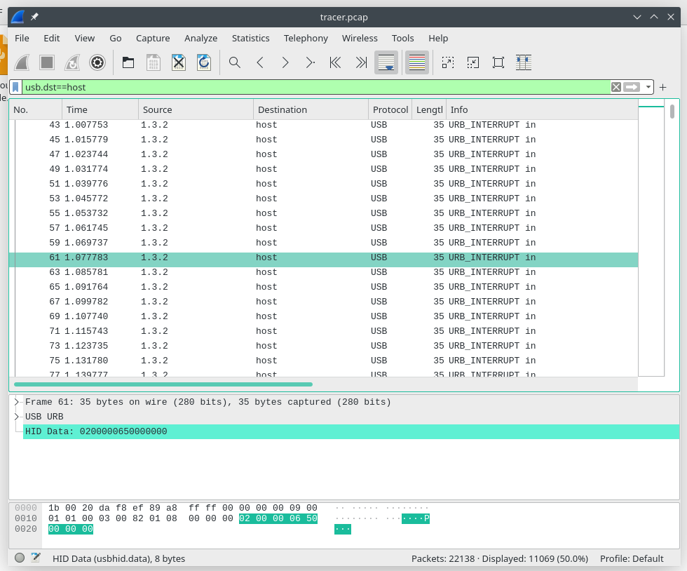
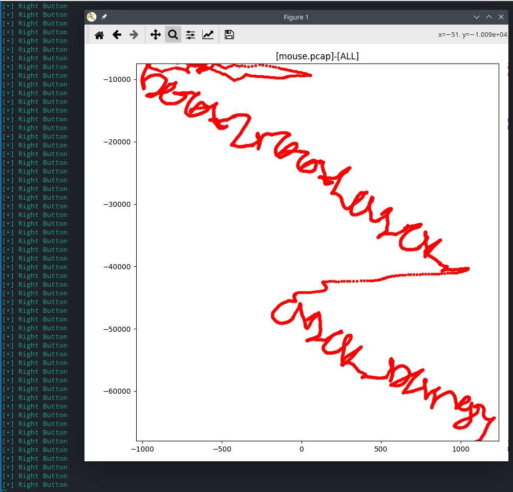

# PCAP Tracing

## Description
> I like to draw the flag

## Solution
This has a USB Mouse capture data... Scraped all data send to host 

To understand the USB protocol data read [this](https://www.usb.org/sites/default/files/documents/hut1_12v2.pdf).
Wrote a enhanced version of [this script](https://github.com/WangYihang/UsbMiceDataHacker) 
The script takes the data and plots the mouse co-ordinates with tkinter and matplotlib

But unlike other mouse data.. the x-coordinate data is send in the 4th byte instead of 3rd.

`PLEASE IMPROVE HANDWRITING AUTHOR`

## Flag
> b00t2root{cl1ck_cl1ck_b4ng}
