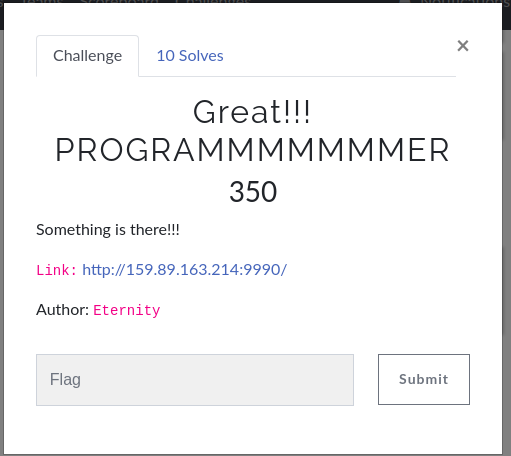
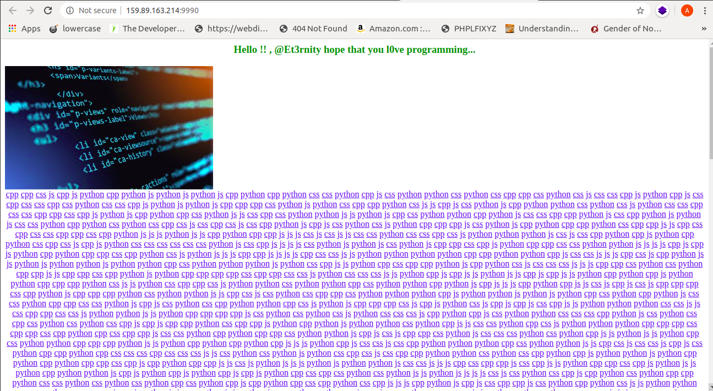
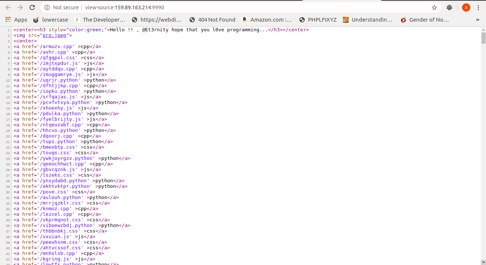
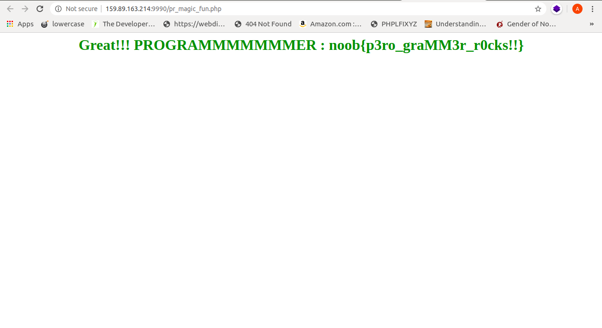

# Challenge Title: iAmProgrammer

### Description:
>This challenge had 350 points and it had 10 solves in total.It was very straight forward web-cum-script challenge.


### Solution: 
When we visit the given webpage:- [iAmProgrammer](http://159.89.163.214:9990), we are welcomed by nearly 4000 files with major file extensions like .js,.cpp,.css etc.

The webpage looks something like:-
	cpp cpp css js cpp js python cpp python js python js python js cpp python cpp ....
	

When we see check the source code,they look like:- 

<a href='/armuzv.cpp' >cpp</a>
<a href='/avhr.cpp' >cpp</a>
<a href='/qfgqpxl.css' >css</a>
<a href='/imjtxpdur.js' >js</a>
<a href='/aytddqu.cpp' >cpp</a>
<a href='/imuggamrye.js' >js</a>
<a href='/uqrjr.python' >python</a>

At the first glance,the file names looked like rot-N ciphers,but they were not those.

So,thought to check what are all distinct types of file extensions being used. Just by skimming,majority of files were .css and .js.

For checking the distinct type of file extensions,I copied all the file extensions from webpage(Not source code) and put it in a file(say extension).

Since we got them all space separated, I wrote this one-liner bash script:-
```
cat extensions|tr " " "\n"|sort|uniq -c
```	
And the output was:-
	*1020 cpp
	*976 css
	*1007 js
	*1 php
	*997 python

As I saw,there was only one php file. I opened it quicky and there was the flag in it in plaintext.

### Flag:

