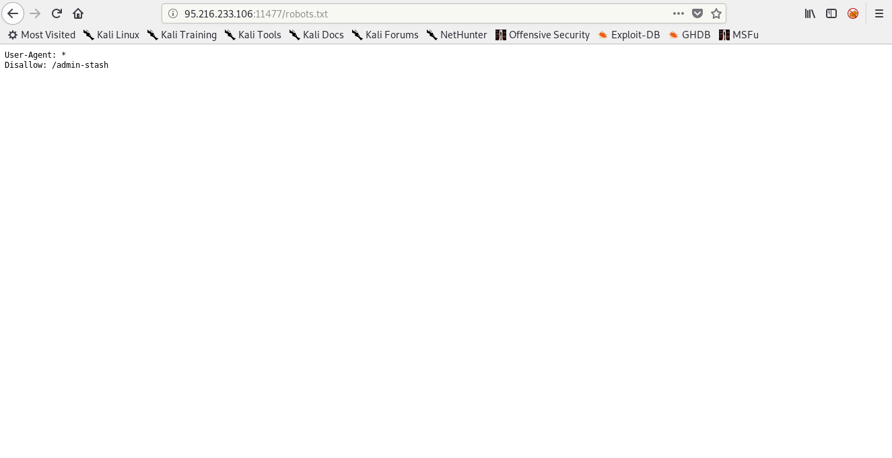
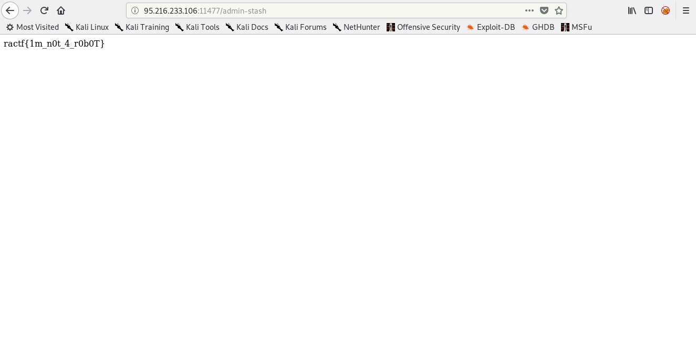

## Quarantine - Hidden Information ractf Writeup

| Problem Description | Points |
| ------------------- | ------ |
| We think there's a file they don't want people to see hidden somewhere! See if you can find it, it's gotta be on their webapp somewhere... | 200 |

Hi this is mywriteup about Quarantine - Hidden Information challenge from ractf. This challenge is categorized as web challenge and i think we only use our enumeration skill for this one. This challange was running at 95.216.233.106:11477. As you can see from problem description we need to find a hidden file, so at first i guess there is something in robots.txt and i checked robots.txt file. I got a dir named admin-stash.

So, i checked the admin-stash dir and boommm! i got the flag.

| The flag              |
| --------------------- |
| ractf{1m_n0t_4_r0b0T} |

Yeah, like i said before this challenge was so simple and only need enumeration skill. So, that is my writeup thanks for read.