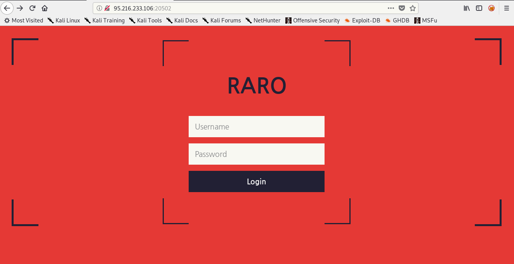
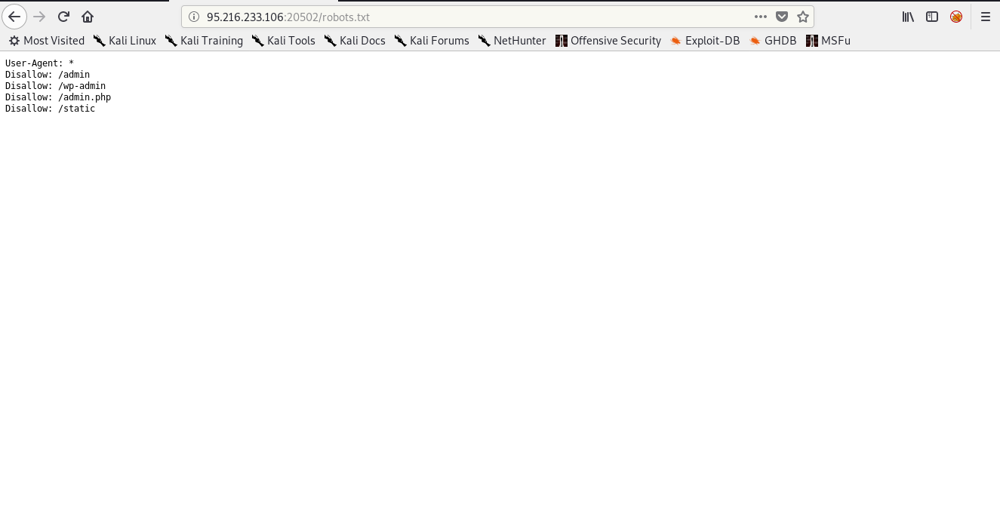
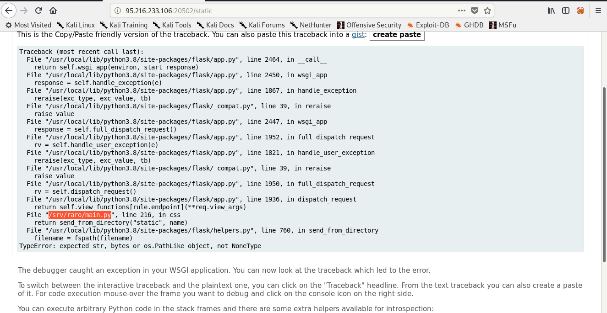
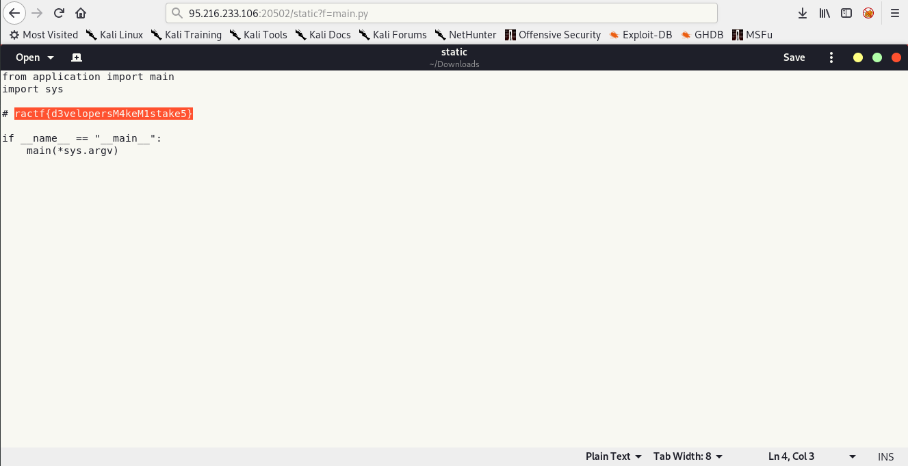

## Insert Witty Name ractf Writeup

| Problem Description | Points |
| ------------------- | ------ |
| Having access to the site's source would be really useful, but we don't know how we could get it. All we know is that the site runs python. | 200 |

Hey, this is my writeup about Insert Witty Name. This challenge is pretty simple and only need you enumeration skill, after you solve the challenge it will give you 200 points. Okay, the challenge is running at 95.216.233.106:20502 and first i checked the main page of the challenge. I got page like this.

I did some enumeration and found there is robots.txt in that site. So, i checked robots.txt file and i got 4 files that is admin, wp-admin, admin.php, and static.

I visited all 4 pages, 3 of them is 404 not found and only static is exists. When i visited static, the page give me python error like this.

based on that error, there is a file named main.py but i cann't found that file with visited that in url. So, i did some enumeration and i found that static has parameter f like this /static?f=index.css. Btw, i found that in source code main page of the site. So, what will happen if we change index.css into main.py? maybe there is flag in main.py. So, i did that and got main.py source code.

| The Flag |
| -------- |
| ractf{d3velopersM4keM1stake5} |

Okay, so that is my writeup about insert witty name thank you for read and see you next time.