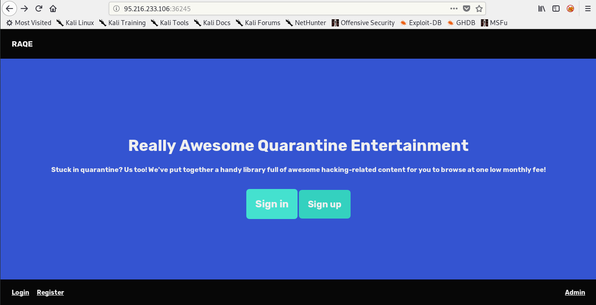
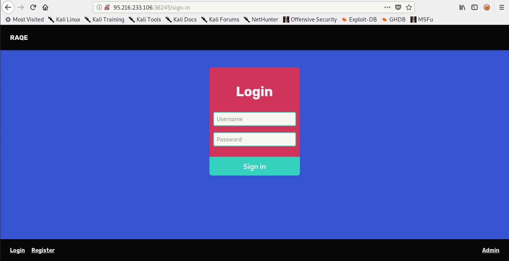
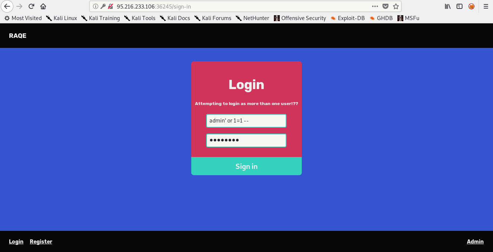
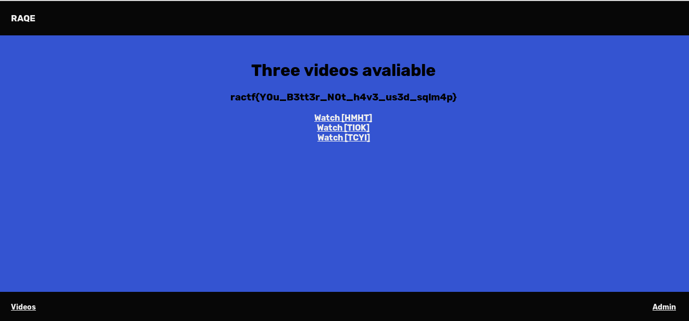

## Quarantine ractf Writeup

| Problem Description 									| Points |
| :------------------ 									| :----: |
|See if you can get access to an account on the webapp.	| 200    | 

This is my writeup one of challenge from ractf, the challange's name is Quarantine. This is a simple and fun challenge, if you solve this challenge will give you 200 points. As you can see from the problem description, this challenge maybe will have sql injection vuln or account weak password. So i visited the web in 95.216.233.106:36245 and got this page.

As you can see, there is 2 choice that is sign-in or sign-up. I tried sign-up first, but the site doesn't open the registration for new account. So, i checked the sign-in page and i got this page.

As i said before, the challange maybe have sql injection vulnerability or account weak pass. So, i choose to test sql injection first and i tried a common sql bypass like this.

> admin' or 1=1 -- 

i tried that payload as username and anything as password. After i tried that i got a message like this.

based on that message, we can know our sql injection payload was successfull executed but we were login more than 1 user. So we can add limit 1 in our payload like this.

> admin' or 1=1 limit 1 -- 

Well after i login with that payload, i got quarantine flag.

| The flag 								 |
| -------------------------------------- |
| ractf{Y0u_B3tt3r_N0t_h4v3_us3d_sqlm4p} |

Okay, so that is my writeup about quarantine challenge i hope this can help you.

