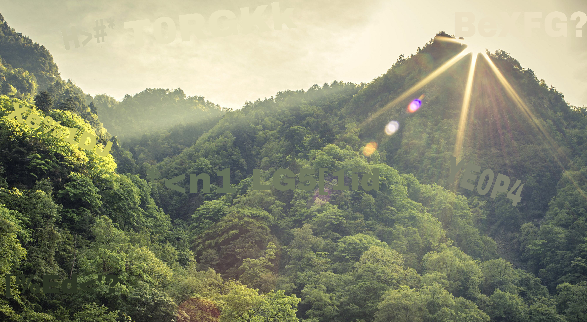

# Challenge Title: Tears

### Description:

>Unknown [12:00] Hey man, i am un1v3rsek1ng

>DreyAnd[12:00] Umm hey, i don't really know you... what is up ?

>Unknown[12:01] Doesen't matter, i have a big problem and need your help. Someone is constantly stealing my galaxy and it all just leaves a tear in my little eye. Please help me i know you are good with this all...

>DreyAnd[12:02] Yo man i've got no idea what you're talking about. I'll try to understand what you're saying ...

>Unknown[12:03] Yeah, we all talk on places for tears...

>DreyAnd[12:04] I still don't understand you ...

>{seen in 12:05}

>2 hours later...

>DreyAnd[Discord: ZH3R0] Hey guys i found this guy, can someone help me?

>Author: DreyAnd 

### Solution: 

This challenge is really unique and awesome credit goes to the author.

I've tried many OSINT tools but didn't get anything then There's a big hint in challenge description(the thing which made us cry is onion).
so after thinking alot i thought the account is not present on surface web and because of that no tool is returning anything usefull. so i started tor and surfing it i've checked the social platforms present on the deep web.

There's one related to challenge 

>galaxy3

http://galaxy3bhpzxecbywoa2j4tg43muepnhfalars4cce3fcx46qlc6t3id.onion/

visit the above url using tor then in search section search for "un1v3rsek1ng"

then we got some results just see below there's a post like un1v3rsek1ng is my friend by "G4l4xyK1nG"

just go to that profile you see the image and in that image there's cipher:

>H>#*T0RGKkBeXFG?Xe%1DJ*<n1LG5[1idYE0P4[%Ed<'

That cipher was base85 just use cyberchef and decode that you got the flag.

### Flag:

zh3r0{0ni0ns_br1ng_m3_t34rs_0f_cry}

Thanks keep hacking..

