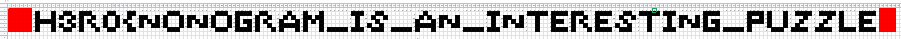

# Math Puzzle
## Misc Challenge

### Description: 
>Student1: do you measure weight in kgs? Student2: NO,NO GRAMS. Password for zip is :
>MvCBm84nAir5yTkygeabaSpGzAZYdHZaGiiKt4ZSm7xYRBVLQg4cUkDujuhGZi3c9gnFGGDwAd4QTmzbcDgAPBkyme5rbyVWVdvi1viDr1UHh85pA8UEeZYEKcRxUHu59nRGojGENojnZNaavXWiEtGtuPoFdwpmRT9rXBuCDvd3CvvuqA7kL2Z1PPdrwJiDx6oqCqNyVc2V8XeHT6fQhYH8QJ9MV7sz4YZ8DMGWSNPEV66e8D3CAvVEpsFHJMAkLUt3VzadkzUJB9i9iVvrkS7bgfPr
>Hint: Don't try rockyou 

>Author : Whit3_D3vi1 

### Solution:
The zip file given to us with the challenge has 40 more zip files in it. 
Each zip contains the zip file to the next challenge along with a corrupted png.
The password for the first zip `Math_puzzle.zip` is given but obviously it is encrypted.
The passwords for the zip files were either hex, base84, base64, base32, reversed string, long int.
All of these can be converted to text using the two links
>[rapidtables](https://www.rapidtables.com/convert/number/ascii-hex-bin-dec-converter.html)
>[CyberChef](https://gchq.github.io/CyberChef/)

Notably the 27th zip and the 20th zip  were a bit of a problem. the 20th one had base85 ipv6 standard encryption and the 27th one had first half hex and the second half long integer.

Unzipping the first zip gives us flag1 file whic has flag1.png and a password protected flag2.zip.
The passwords for every flag`n`.zip is hidden in flag`n-1`.png. hexdump of the pngs reveals the password in plain text at the end.
The strings command does the job perfectly here.
```
string flag1.png
``` 

The corrupted png's have jpg file signature though all the chunks are from that of a png.
also the chunk header (chunk data type) for `IHDR` and `IDATA` have been interchanged.
The png can be corrected by replacing the corrupted hx data with the right one in any f your favourite hex editor:
1. `89 6a 70 65 67 0a 1a 0a`	-->	`89 50 4e 47 0d 0a 1a 0a`
2. `49 44 41 54`	-->	`49 48 44 52`
3. `49 48 44 52`	-->	`49 44 41 54`

>Note: Some of the flag seemed to be missing some hex values for the png file signature. Make sure they are right.

The images seem to form a nonogram puzzle.
The key that i learnt to solve a nonogram puzzle is to start from the highest number first.
Since I had never solved a nonogram before, i started combining the images after correcting them to form a grid like pattern in nonograms. But things started getting complicated and i tried solving them individually.
Each png gives a letter for the flag.
You can look up how to solve nonograms. I used the one given below.
>https://www.puzzlemuseum.com/griddler/gridins.htm
I had rpoblem figuring out `S` in the nonogram but I was able to guess it in the end.
The first and last images (flag1.png and flag40.png) had crc errors even after correcting them manualy and with [PCRT.py](https://github.com/sherlly/PCRT). But they can be figured out too

After solving the nonogram it looked something like this:


### Flag:
`zh3r0{NONOGRAM_IS_AN_INTERESTING_PUZZLE}`


